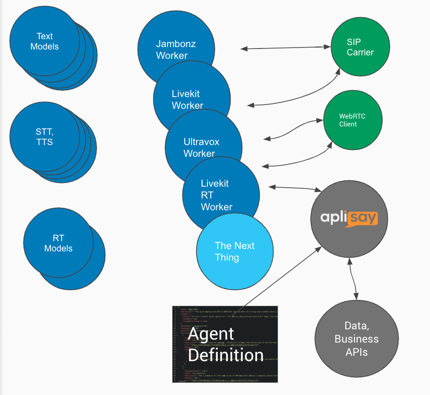
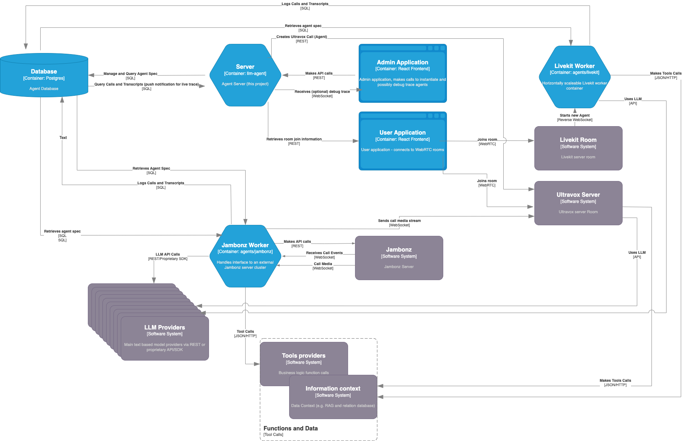

# llm-agent

LLM based agentic audio AI framework.

Designed to solve the problem of allowing platform agnostic AI agents to be defined for rapid prototyping and comparison of different models and architectures.

Implements a JSON agent definition schema and a REST interface to orchestrate deployment on a range of LLM and runtime platforms and the resultant full duplex audio streams exposed in either WebRTC rooms or on telephone calls via SIP.

Build agents once, test and then deploy to any platform in a portable way.

Prototype your own agents at the [Playground](https://playground.aplisay.com).

## Architecture

The architecture has morphed substantially from the original design back in late 2022 to incorporate a wide range of AI models and runtimes within a very horizontally scaleable architecture to support our commercial deployments. It can now deliver well over 1000 concurrent calls to an agent and is generally limited only by LLM provider capacity.

At a conceptual level, it looks like this, with the `llm-agent` server processing agent definitions and instantiating these to deploy them on a number of different LLM platforms and underlying models.



The `llm-agent` server (this project) provides the REST interface to define and deploy agents. This is just a stateless container that mutates the underlying database and coordinates real time debug logs back to the client when an agent is being developed and debugged.

The real time agent management is done through framework specific worker processes that are deployed to a container platform. All of the worker processes are stateless, load selected agent definitions from the database on-demand and can be scaled horizontally to handle production loads. The major components and data flows are:



Note that Ultravox is a bit of a special case as all of the agent running logic is provided by their runtime platform. Even the tools calls are made directly across the Internet from their servers to reduce latency. We don't therefore have or need a worker container for Ultravox. 
### Models:

 * Anthropic Claude text mode with an external STT/TTS
 * OpenAI (GPT-3.5 - 4o) text mode with an external STT/TTS
 * OpenAI GPT-4o realtime
 * Ultravox (Llama 8B & 70B) realtime
 * Google (Gemini - gemini-1.0/1.5) text mode with an external STT/TTS __2.0 realtime coming soon__
 * LLaMA3 (8 & 70b) text mode with an external STT/TTS
 * Mixtral 8x7b text mode with an external STT/TTS
 * Gemma 7b text mode with an external STT/TTS

### Runtime frameworks:

 * WebRTC: Ultravox and Livekit Rooms
 * SIP: Jambonz

 Ultravox is really Livekit under the hood for WebRTC clients, but we access it cleanly via their SDK abstraction.
 For Ultravox phonecalls, we currently pragmatically use Jambonz only to gateway to SIP and grab media that we exchange with their model via their WebSocket Interface.

 As a direction of travel, SIP via Livekit and direct to Ultravox are planned as alternative architectures for deployments where Jambonz is not otherwise required.

### STT/TTS:

For text mode models, we currently interface to the following STT/TTS providers:

 * ElevenLabs
 * Deepgram
 * Google

Additionally, there is some hacky support in a branch for Amazon TTS that could be merged if a commercial case requires it.

## Installation

You will need a Jambonz instance or account with some unallocated inbound telephone numbers routed from a SIP trunk provider to allow inbound calls to the agent.
Ensure the spare numbers are listed on your Jambonz dashboard and do not currently have any application associated with them. Add STT and TTS provider credentials to Jambonz for the Google provider. Add an application API key to Jambonz, and copy it into your clipboard.

Clone this repo, and add the following environment variables (the repo uses .env so you can either directly place variables in your environment or copy the [Environment Example](https://github.com/aplisay/llm-agent/blob/main/environment-example) directly to a `.env` file:

```shell
ANTHROPIC_API_KEY=<YOUR ANTHROPIC KEY>
GOOGLE_PROJECT_ID=<YOUR GOOGLE PROJECT ID>
GROQ_API_KEY=<YOUR GROQ KEY>
OPENAI_API_KEY=<YOUR OPENAI KEY>
GOOGLE_PROJECT_ID=<YOUR GOOGLE PROJECT ID>
GOOGLE_PROJECT_LOCATION=<YOUR GOOGLE PROJECT LOCATION>
GOOGLE_APPLICATION_CREDENTIALS=<PATH TO CREDENTIAL JSON FILE>
DEEPGRAM_API_KEY=<YOUR DEEPGRAM KEY>
ELEVENLABS_API_KEY=<YOUR ELEVENLABS KEY>
JAMBONZ_SERVER=<JAMBONZ API SERVER HOSTNAME>, usually api.server.name
JAMBONZ_API_KEY=<JAMBONZ API KEY>
JAMBONZ_AGENT_NAME=<THIS SERVER DNS NAME>
LOGLEVEL=info
AUTHENTICATE_USERS=NO
```
Note that the last line is important. Because we run this code as a free service on our own infrastructure, it will by default attempt to authenticate clients. You probably don't want this if you are running a local test copy on your own infrastructure as it uses Firebase which has a huge number of steps and possibly some cost to get working auth.
### Install dependencies

```yarn install```

### Start server

```yarn develop```


## Running

There is a free client in source form at [llm-frontend](https://github.com/aplisay/llm-frontend) which targets the API presented by this project.
See the instructions on that application to deploy locally.

There is also a free [LLM Runner](https://github.com/aplisay/llm-frontend), which takes a JSON agent definition and runs it against this API, creating the agent and implementing function calls when they are dispatched by the LLM.

### API

Implements a REST API, which is documented [in swagger here](https://llm.aplisay.com/api).

List agent type names available by `GET`ing from `/api/agents` (currently `gpt35`for GPT3.5-turbo or `palm2` for Google PaLM2)

Create an agent by `POST`ing a `prompt` and `modelName` from above to same path. The returned structure contains the unique `id` of the agent, the spare `number` that was allocated, and a Websocket path in `socket` for a progress feed. Connect to the path in `socket` to get a real-time JSON event feed of all interactions (connections, received and sent utterances, data and hangups).

The agent can be modified by issuing a `PUT` to `/api/agents/${id}` where `id` is a previously returned agent id. This will take effect from the first new call after the update.

The agent can be activated as a listener by issuing a `POST` to `/api/agents/${id}/listen` where `id` is a previously returned agent id.
Body parameters include `number` which allows a phone number, or wildcard to be specified. This will start the agent and allow either WebRTC rooms to be created which are served by this agent listener, or SIP calls to be placed to the agent on the `number` if it has been defined.
It is also possible to specify an `options` object on the body, and setting the `streamLog` property on this to true will cause the agent handler to return a socket URL. Listening on this socket URL will provide a real-time JSON event feed of all interactions (connections, received and sent utterances, data and hangups) for conversations on this listener. This is useful for debugging and testing of agents and is used for example in the [playground](https://playground.aplisay.com/)

To join a WebRTC room, issue a `POST` to `/rooms/{listenerId}/join` which, depending on the agent model and framework will return an object with either `livekit` property which contains the room `url` and `token`, or an `ultravox` property which contains the `joinUrl` for the Ultravox room.

The agent based listener is deactivated by issuing a `DELETE` to `/api/agents/{agentId}/listen/{listenerId}`. This is particularly important for telephone listeners as otherwise you will leak phone numbers and leave extraneous applications lying around on your Jambonz instance.
The agent is automatically deleted when your client disconnects the progress WebSocket so this does provide an active backstop to prevent this only if your client connects to and maintains that socket.
Currently, if the client never connects to the socket, then the agent will exist until it actively calls DELETE, so you will leak agents until you run out of numbers if you do this.
At some future point, the code will probably either move to mandating websocket connection, or implementing an idle timeout so that quiescent agents are deleted.

In addtion to the prompt, the `POST` and `PUT` also allow an optional agent `options` structure to be passed to modify LLM parameters.
Currently, this supports temperature which has a value between 0 and 1 (inclusive) and is mapped directly to the same value in `PalM2` model. It is multiplied by 2 to generate this parameter to GPT3.5 which takes a value between 0-2 natively. The options structure can also be used to pass the `tts` and `stt` parameters for speech recognition.

```javascript
{
  temperature: t
  tts: {
    vendor: "google",
    language: "en-GB",
    voice: "en-GB-Wavenet-A"
  },
  stt: {
    vendor: "google",
    language: "en-GB"
  },
  outboundCallFilter: "^\\+44[1237]\\d{6,15}$"
}
```

The `outboundCallFilter` option is an optional regular expression pattern that filters outbound calls generated by this agent (via the originate endpoint or transfer function). The regexp is anchored with `^` and `$` to match the complete phone number. Only outbound calls where the destination number matches this pattern will be allowed.

**Examples:**

- UK geographic and mobile numbers: `^\+44[1237]\d{6,15}$`
  - Matches: `+442080996945`, `+447911123456`
  - Does not match: `+441234567890` (invalid area code)

- Australian geographic numbers: `^\+61[23456789]\d{8}$`
  - Matches: `+61234567890`
  - Does not match: `+611234567890` (invalid area code)

- Extension numbers: `^\d{3,6}$`
  - Matches: `123`, `4567`, `123456`
  - Does not match: `12` (too short), `1234567` (too long)

- UK numbers or extensions: `^(\+44[1237]\d{6,15}|\d{3,6})$`
  - Matches: `+442080996945`, `+447911123456`, `123`, `4567`

When an agent is no-longer needed, issue a `DELETE` to `/api/agents/${id}`. 


## Development

See [Developer Documentation](API.md) for class structure.

The rough backlog for development work on this project now involves implementation in the following areas (in no particular order):

  *  Gemini 2.0: add this to the realtime agent flow, probably via Livekit although we could interface to the Google WebSocket directly, especially for the telephony use case.

  *  A "bot API" text injection endpoint to improve bot to bot interactions, allow BYOSTT for clients, and allow use of core logic by text based UIs.

  * We currently only support telephony through Jambonz, which is very appropriate for many use cases. We should support other channels, such as LiveKit SIP gateway and a native SIP/WebSocket gateway for cases like Ultravox where our use of Jambonz is probably too trivial to justify it's deployment for this use case alone.

If you want to work on one of these areas let me know, happy to accept contributions.
