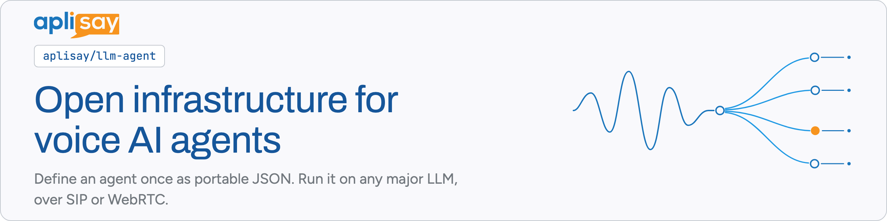

[](LICENCE)
[](https://llm.aplisay.com/api)
[](https://playground.aplisay.com)

**Open infrastructure for voice AI agents** — `llm-agent` is the MIT-licensed core of the [Aplisay](https://aplisay.com) platform.

Define an agent once, as a portable JSON document — prompt, model, voice, tools and call handling. `llm-agent` runs it on your choice of LLM, speech-to-speech or full STT → LLM → TTS pipeline, and puts it on a real phone call over SIP or in a browser over WebRTC. Change vendor by changing one field; the agent, and your data, stay yours.

This is not a demo framework: it is the code Aplisay operates in production, delivering well over 1,000 concurrent calls per agent and limited in practice only by LLM provider capacity. Run it yourself — locally, on Kubernetes or Cloud Run — or let us run it for you.

## What you get

- **No model lock-in** — OpenAI, Google Gemini, Anthropic Claude, Moonshot Kimi, DeepSeek, OpenRouter and Ultravox speech-to-speech. Swap with a `modelName` change, or [fail over between agents automatically](docs/agent-failover.md).
- **Real telephony** — inbound DDIs, SIP trunks and registrations ([phone endpoints](docs/phone-endpoints-api.md)), [outbound calls](docs/originate-api.md), [blind, consultative and bridged transfers](docs/call-transfers.md), [human handback](docs/human-handback-howto.md), [call recording](docs/call-recording.md) with client-held encryption keys, and [webhooks on call events](docs/call-hooks.md).
- **WebRTC built in** — the same agent that answers a phone number joins browser and app sessions; no separate stack to run.
- **Tools** — HTTP function calling with anti-fraud parameter sourcing, [tool-call chaining and metadata priming](docs/tool-call-chaining-metadata-priming.md), and [remote MCP servers](docs/mcp-servers.md) on supporting models.
- **Multi-agent** — [agent sets, in-call subagents and agent-to-agent handover](docs/agent-sets-and-subagents.md) managed as a single document.
- **Built to operate and resell** — multi-tenant organisations with scoped API keys, [per-agent/user/organisation concurrency limits](docs/agent-concurrency-limits.md), usage metering with rate-card billing, and encrypted credential storage.

## Models, voices and runtimes

| Layer | Options |
|---|---|
| Voice runtimes | LiveKit (WebRTC + SIP) · Pipecat (SIP + WebRTC) · Jambonz (SIP) · Ultravox cloud (managed realtime) · headless text channel |
| Speech-to-speech models | OpenAI Realtime · Google Gemini Live · Ultravox v0.6/v0.7 (Llama, Gemma and GLM backends) |
| Pipeline LLMs | OpenAI GPT-4o / GPT-5 mini · Google Gemini 2.x · Anthropic Claude · Moonshot Kimi · DeepSeek · OpenRouter |
| Speech recognition & synthesis | Deepgram · ElevenLabs · Google · Cartesia (+ Silero VAD) |
| SIP connectivity | Jambonz · LiveKit SIP · bundled Go [`sipbridge`](docs/sipbridge-integration.md) · FreeSWITCH · [Voiceblender](docs/voiceblender-integration.md) · Daily |

Which models run on which runtime varies as providers evolve; `GET /models` on any running instance is the authoritative catalogue.

## Architecture

A stateless Node.js API server holds the control plane: it validates and stores agent definitions in PostgreSQL, dispatches them to runtime workers, and streams live transcript/tool-call events back over WebSocket while you develop.


Real-time conversation handling runs in per-runtime worker processes — LiveKit (TypeScript), Pipecat (Python) and Jambonz (Node.js). Workers are stateless, load agent definitions from the database on demand, and scale horizontally to production load. Ultravox agents need no worker at all: their runtime is fully managed, with tool calls made directly from the Ultravox cloud.


The full picture — call lifecycle, scaling model, gateway options — is in the [architecture overview](docs/architecture.md).

## Run it

```shell
git clone https://github.com/aplisay/llm-agent.git && cd llm-agent
yarn install && (cd agents/livekit && yarn install)
cp environment-example .env    # then set database, auth and provider keys
yarn develop
```

You'll need Node 22+, PostgreSQL, and credentials for at least one LLM provider and one runtime. The **[running guide](docs/running.md)** walks through environment configuration, minimum viable setups (WebRTC-only or full telephony), starting the workers, tests and deployment.

## The API

Everything is a REST resource, described by an OpenAPI document and browsable at [llm.aplisay.com/api](https://llm.aplisay.com/api): create an **agent** from a JSON definition, activate it as a **listener** on a phone number or WebRTC room, then watch **calls**, transcripts, recordings and usage flow from it. A WebSocket feed streams every utterance, tool call and result in real time — the Playground's live trace is just this feed.

Client-side, [llm-frontend](https://github.com/aplisay/llm-frontend) is an open-source web client for the whole API, and [`@aplisay/react-widget`](https://www.npmjs.com/package/@aplisay/react-widget) embeds agent audio in your own site.

## Documentation

| Topic | Doc |
|---|---|
| Install, configure, first call | [Running llm-agent](docs/running.md) |
| System design and scaling | [Architecture overview](docs/architecture.md) |
| Transfers, handback, redirects | [Call transfers](docs/call-transfers.md) |
| Recording and retrieval | [Call recording](docs/call-recording.md) |
| Teams of agents | [Agent sets and subagents](docs/agent-sets-and-subagents.md) |
| External tools | [MCP servers](docs/mcp-servers.md) |
| Numbers, trunks, registrations | [Phone endpoints](docs/phone-endpoints-api.md) |
| Vulnerability reporting | [SECURITY.md](SECURITY.md) |

The **[full documentation index](docs/README.md)** covers the rest, from gateway integrations to vendor-specific options. Platform-level guides live at [aplisay.com/docs](https://aplisay.com/docs).

## About Aplisay

The sponsor of this project, Aplisay, is a UK-based team with a long history in real-time communications. Our voice AI work started in 2020 with a UKRI-funded project providing voice automation to covid response teams; we demonstrated one of the first LLM-driven telephone agents in 2023 — then open-sourced and have continuously developed the platform since then.

We build and operate the full stack — this platform, the browser widget, and the SIP edge that connects it to carrier networks. For operators and telephony service providers we take on whole implementations: conversation design, back-end integration, SIP interconnect and production operation, on our infrastructure or yours. [Talk to us](https://aplisay.com/contact).

## Contributing, security, licence

Issues and pull requests are welcome — `yarn test:no-db` runs the fast suite, and [docs/ci-testing.md](docs/ci-testing.md) describes the full gate. Please report vulnerabilities privately per [SECURITY.md](SECURITY.md).

Released under the [MIT licence](LICENCE), © Aplisay Ltd.
