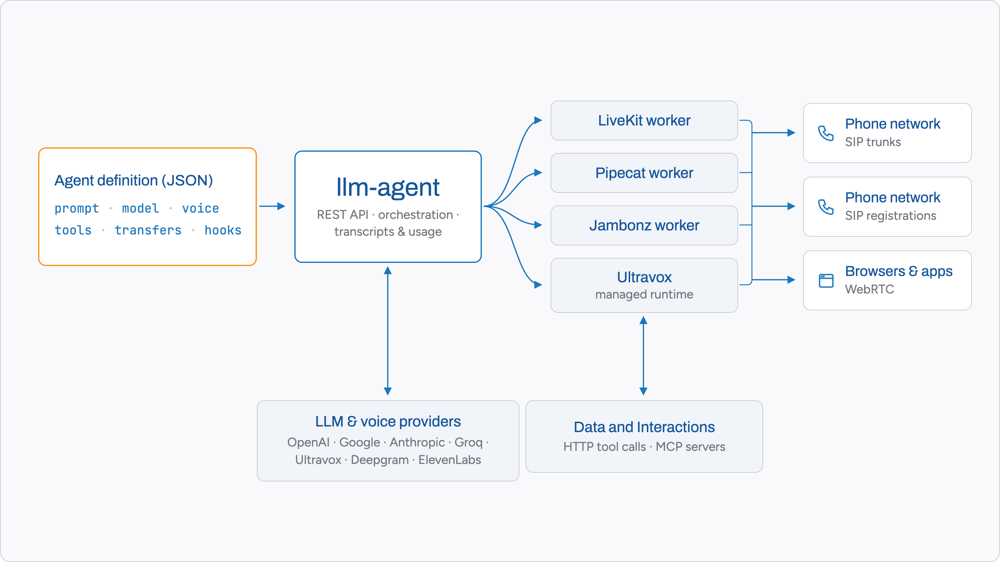
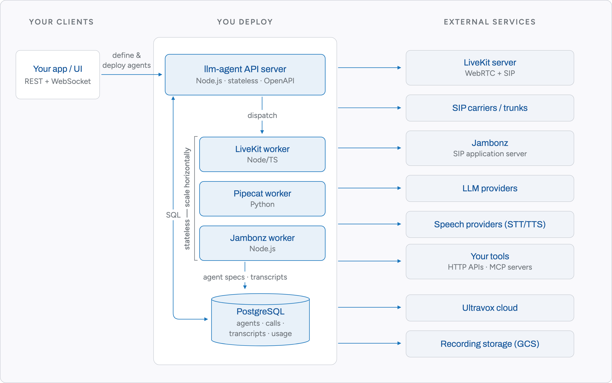

# Architecture overview

`llm-agent` separates a stateless **control plane** (the REST API server) from a horizontally scalable **realtime plane** (per-runtime workers that hold live conversations). Everything durable lives in PostgreSQL; every process can be replaced or scaled without draining state.

## Concept

One agent definition — a JSON document holding prompt, model choice, voice, tools and call-handling options — deploys unchanged to any supported runtime:

## Components

- **API server** (`index.mjs`, `api/`, `lib/`) — Express with the REST surface generated from [`api/api-doc.yaml`](../api/api-doc.yaml). It manages agents, listeners, calls, phone endpoints, organisations, usage and rates, and serves WebSocket feeds of live call events (transcripts, tool calls, hangups) for development and monitoring. It is a stateless container: all state mutations go to the database.
- **PostgreSQL** — agent definitions, listeners, calls and transcripts, phone endpoints and registrations, usage records and rate cards. Development syncs schema automatically; production upgrades run through an internal schema-version gate.
- **Runtime workers** (`agents/`) — the processes that join calls and speak:
  - `agents/livekit` (TypeScript) — WebRTC rooms and SIP via LiveKit, running realtime models (OpenAI Realtime, Ultravox) and STT→LLM→TTS pipelines; also hosts call recording.
  - `agents/pipecat` (Python) — Pipecat frame pipelines for both speech-to-speech and pipeline models, with pluggable SIP ingress ([`sipbridge`](sipbridge-integration.md), FreeSWITCH, [Voiceblender](voiceblender-integration.md), Daily) and WebRTC.
  - `agents/jambonz` (Node.js) — drives an external [Jambonz](https://jambonz.org) cluster for SIP telephony with text-pipeline models.

  Workers are stateless: they load the agent definition from the database when a call arrives, stream media and model traffic for the duration, then write back transcripts and usage. Scale is horizontal — add worker replicas per runtime.
- **Ultravox** is the exception that proves the model: agents on Ultravox run entirely in their managed cloud (no local worker), with tool calls made directly from Ultravox servers for latency.
- **Tools** — agents call your business over plain HTTP function definitions or remote [MCP servers](mcp-servers.md); parameters can be statically pinned or metadata-sourced to keep LLM-invented values out of sensitive fields (see [call transfers](call-transfers.md) for the anti-fraud rationale).

## Life of a call

1. A client `POST`s an agent definition; the server validates it against the model catalogue and stores it.
2. The agent is activated as a **listener** — bound to a phone endpoint (DDI, trunk, registration) or opened for WebRTC room joins.
3. An inbound call (or [originated outbound call](originate-api.md)) reaches the runtime's gateway; a worker picks it up, loads the agent spec, and runs the conversation — speech-to-speech, or STT → LLM → TTS with the configured voices.
4. Tool calls fan out to your HTTP endpoints/MCP servers; [transfers](call-transfers.md), [recording](call-recording.md) and [hooks](call-hooks.md) fire as configured; every event streams over the listener's WebSocket feed.
5. Transcripts and per-call usage land in the database; [concurrency limits](agent-concurrency-limits.md) and rate cards are enforced/attributed per organisation.

## Scale and resilience

All request-path processes are stateless containers, so capacity is a replica count. The stack delivers well over 1,000 concurrent calls per agent in commercial deployments, with LLM provider capacity the practical ceiling. [Agent failover](agent-failover.md) provides automatic fallback to an alternate agent or number on startup failure or disconnect.

## Deeper reading

- [LiveKit agent architecture](livekit-agent-architecture.md) — the most detailed runtime write-up (worker lifecycle, SIP abstraction, realtime models)
- [sipbridge integration](sipbridge-integration.md) and [Voiceblender integration](voiceblender-integration.md) — SIP ingress options for the Pipecat runtime
- [LiveKit ⇄ Pipecat transfer parity](livekit-pipecat-transfer-parity.md) — feature parity between the two main runtimes
- [Running llm-agent](running.md) — how to stand all of this up
